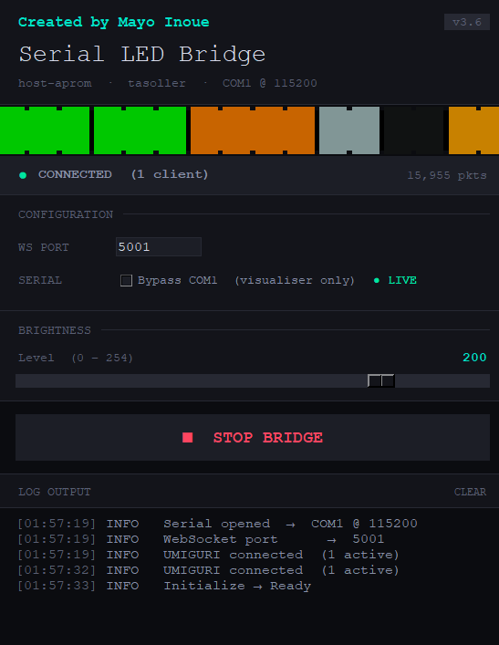

> [!WARNING]
> This project is partially vibe-coded.
>
> While core protocol handling, LED mapping, and hardware behavior have been
> manually verified on real hardware, some implementation details were developed
> rapidly and experimentally during reverse-engineering and live testing.
>
> Expect:
> - questionable engineering decisions
> - cursed edge cases
> - inconsistent comments
> - occasional "why does this work" moments
>
> Contributions, cleanup PRs, and sanity restoration are welcome.

# UMIGURI LED Bridge

> Real-time WebSocket → Tasoller LED bridge for UMIGURI and host-aprom firmware.

<p align="center">
  
</p>

---

## Overview

UMIGURI LED Bridge is a lightweight Windows utility that connects  
UMIGURI's WebSocket LED output to Tasoller / host-aprom firmware
slider hardware over serial communication.

---

## Tested Hardware

- Tasoller using [host-aprom](https://gitea.tendokyu.moe/tasoller/host-aprom)

---

# Installation

## Requirements

- Windows 10 / 11
- Python 3.10+
- a Tasoller with [host-aprom](https://gitea.tendokyu.moe/tasoller/host-aprom) firmware
- UMIGURI configured for WebSocket LED output

---

## Install Dependencies

```bash
pip install websockets
```

---

## Run

```bash
python main.py
```


---

# UMIGURI Configuration

Set UMIGURI LED Server Port to whichever port is configured inside the bridge

---

# Credits
Bridge created by Mayo Inoue 

Special thanks to:
- UMIGURI developers
- host-aprom contributors
- rhythm game hardware community
- Tasoller reverse-engineering efforts

---

# Disclaimer

This project is an unofficial community tool and is not affiliated with
GAMO2, SEGA, Konami, or any arcade/controller hardware manufacturer.
